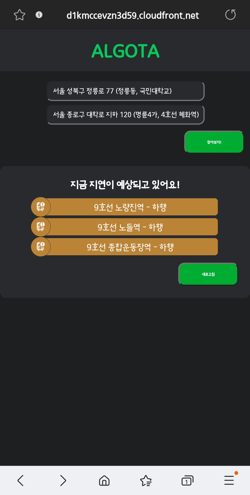
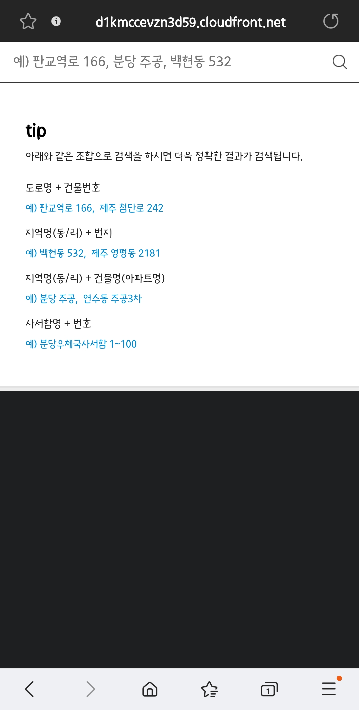
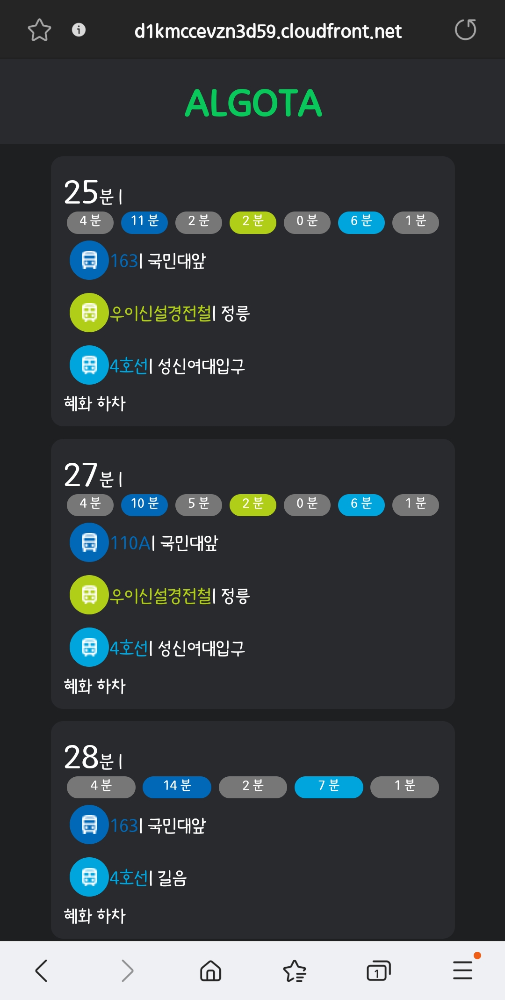

# 알고타 - 2023 캡스톤디자인 04조

### 1. 프로잭트 소개

22년 하반기 전장연의 시위로 인한 학생 및 직장인들의 대중교통, 특히 지하철 이용이 어려웠다. 

지하철 실시간 도착 정보를 활용하여, 시민들이 지하철을 타고 이동하는 경로에 지연 정보를 알려준다면 어떨까?

해당 정보를 통해 지하철이 아닌 다른 방법으로 이동을 하면 시민들의 불편함을 줄일 수 있다고 생각해서 프로젝트를 기획했다.

---

### 2. 소개 영상

 

영상을 보시려면 사진을 눌러주세요.

---

### 3. 팀 소개
팀장 - 한국역사학과 천성규 (****0269)

팀원 - 임산생명공학과 김명찬 (****2026)

---

### 4. 사용법

<h2>메인 화면</h2>

처음 사이트에 접속했을 때 나오는 메인화면이다. 

출발지와 도착지를 입력하여 길찾기를 할 수 있고, 현재 지연되고 있는 지하철 역에 대한 정보를 제공한다.

<h2>검색 화면</h2>

검색어를 입력하면 관련 검색어를 띄워준다. 

리스트 중에서 원하는 곳을 누르면 해당 주소로 출발지 및 목적지를 지정할 수 있다.

<h2>결과 화면</h2>

출발지와 목적지를 입력하면 해당 경로까지 걸리는 시간을 보여준다.
